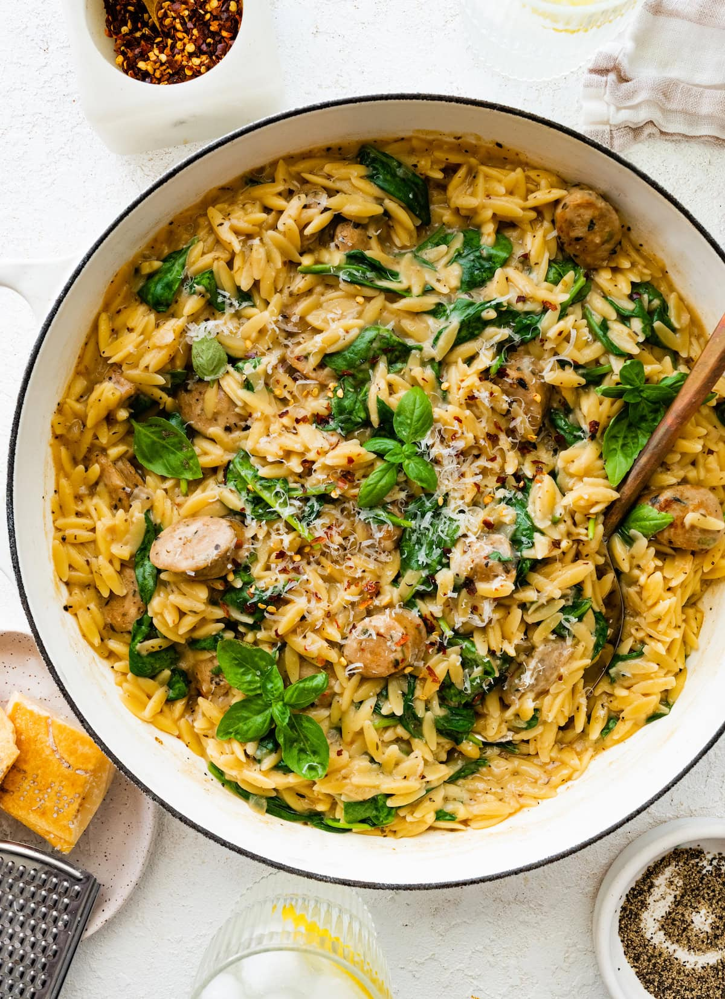

# One Pot Sausage Spinage Orzo

[Source](https://www.eatingbirdfood.com/one-pan-chicken-sausage-and-orzo/)

## Ingredients

- 1 tablespoon olive oil
- 1 cup chopped yellow onion
- 4 cloves garlic, minced
- 1 12oz package mild Italian chicken sausage
- 2 cups dry orzo
- 4 cups chicken broth
- 1 teaspoon Italian seasoning
- salt
- pepper
- 1/2 cup heavy cream
- grated parmesan
- 5 oz baby spinach
- crushed red pepper (optional)
- fresh basil, for garnish

## How to cook

1. Add oil to a large skillet over medium heat. Once hot
add onion and garlic. Cook for about 5 minutes, stirring
often.

2. Add the chicken sausage into the pan. Sauté for another
5-6 minutes or until golden.

3. Add orzo to the pan and stir for 1 minute to toast.

4. Add the chicken broth, coconut milk, salt, pepper and
Italian seasoning. Stir to combine.
