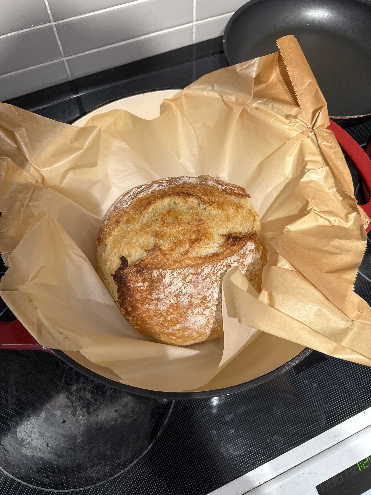

# Artisan Bread

## Ingredients

- 3 cups bread flour (395 grams)
- 2 1/4 tsp instant dry yeast
- 1/2 Tbsp iodized salt
- 1 1/2 cups warm water (105°F)

## Instructions

1.  Mix flour, yeast, and salt in a large bowl.
2.  Mix the dough as you pour the warm water into the bowl. Do a handful of
    batches. Mix until the dough is sticky. You can use a spatula or wooden
    spoon.
3.  Cover with a towel or plastic wrap for 2 hours or leave in the fridge from
    8-24 hours. The longer you let it rise, the more it will ferment. Dough
    should be double in size.
4.  Once dough has risen, preheat the oven to 450°F and place a dutch oven into
    the oven.
5.  If the dough was in the fridge, let the dough come to room temperature
    (about 10 minutes). Use a spatula to break up the dough from the edges of
    the bowl. Gently pull the sides up and fold into the middle, each time
    rotating the bowl 90 degrees. Do this about 9 times. This should strengthen
    the dough.
6.  Dust a working surface with flour then flip the bowl upside down facing the
    surface to remove the dough. Lightly dust the top of the dough with flour.
    Flour your hands then shape the dough into a circle by gently squeezing
    under the dough and spinning clockwise.
7.  Transfer to a piece of parchment paper and cover with another piece of
    parchment paper. Let it rest for about another 10 minutes.
8.  Cut a slit down the top of the piece of dough.
9.  Remove your dutch oven and place the dough inside covered. Bake for 30
    minutes. Then, remove the lid and bake for another 15 minutes.
10. Let it rest once out of the oven then enjoy!

## References

- https://www.iheartnaptime.net/artisan-bread/#recipe (ingredients)
- https://youtu.be/OZiTD7iQ_0E?si=toSZ6-Vd8JGdewLt (technique)

## Pictures

