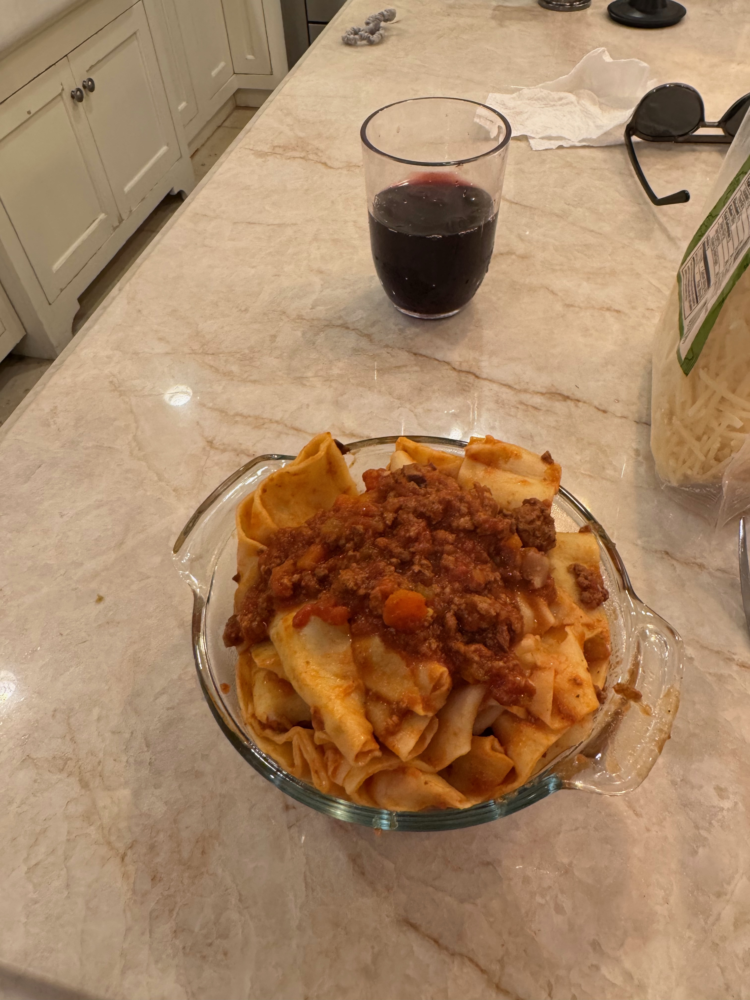

# Bolognese

For the sauce:
Makes about 9 cups of sauce

## Ingredients

- 2 tbsp olive oil
- 2 lb ground beef (85/15)
- 1 lb ground pork 
- Kosher salt and freshly ground black pepper to taste
- 4 oz. pancetta, cut into 1/2 inch dice
- 1 yellow onion, finely diced (can use extra)
- 2 carrots, peeled and finely diced
- 1 celery stalk, finely diced (can use extra)
- 5 garlic cloves, minced (can use extra) 
- 1/3 cup tomato paste
- 1 cup dry red wine
- 1 cup  milk or heavy cream 
- 2 cans (each 28 oz) whole tomatoes, passed through a food mill OR mutti chopped tomatoes, or polpa/passata 
- 2 bay leaves
- 1 Parmigiano-Reggiano cheese rind
- 1 lb tagliatelle or parpadelle, cooked (see below for homemade parapadelle or tagliatelle recipe)
- Grated Parmigiano-Reggiano cheese for serving 

## Instructions

1.  In a dutch oven over medium-high heat warm 1 tbsp of olive oil 
2. Add the ground beef, pork, salt and pepper and cook until browned, about 12 minutes and then transfer to a paper towel lined plate
3. Add the pancetta to the pot and cook until crisp, about 7 minutes and then transfer to a paper towel lined plate
4. Reduce the heat to medium and warm the remaining 1 tbsp of oilive oil 
5. Add the onion, carrots, and celery and cook until soft and translucent, about 8 minutes
6. Add the garlic and cook, stirring constantly for 1 minute
7. Stir in the tomato paste and cook for 2 minutes
8. Add the wine and simmer until almost evaporated, about 5 minutes
9. Add the ground meats, pancetta, milk, tomatoes, bay leaves, cheese rind, salt and pepper and bring to a simmer
10. Cover the pot and simmer until the sauce thickens, for at least 4 hours. 
11. Discard the bay leaves and cheese rind, adjust the seasonings with salt and pepper, and mix with parpadelle or tagliatelle

For the fresh pasta:
Makes about 3 servings of pasta

## Ingredients

- 2 cups of all purpose flour, spooned and leveled
- 3 large eggs
- 1/2 teaspoon sea salt
- 1/2 tablespoon extra-virgin olive oil

## Instructions

1. Place the flour on a clean work surface and make a nest
2. Add the eggs, olive oil, and salt to the center and use a fork to gently break up the eggs, keeping the flour walls intact
3. Use your hands to gently bring the flour inward to incorporate
4. Continue working the dough with your hands to bring it together into a shaggy ball
5. Knead the dough for 8 to 10 minutes - at the beginning the dough should feel pretty dry but stick with it, it might not feel like its going to come together but after 8-10 minutes it should be cohesive and smooth
6. If the dough seems too dry still, sprinkle fingers with a little bit of water to incorporate, and if it is too sticky dust more flour onto the work space
7. Shape the dough into a ball, wrap tightly in plastic wrap, and let it rest at room temperature for at least 30 minutes and up to 2 hours
8. Slice the dough into 4 pieces, gently flatten one into an oval disk and continue to roll out with a rolling pin until very thin and nearly see through 
9. On a floured surface, ribbon the sheet of dough into one stack 
10. Cut the dough stack into skinnier or wider strips depending on if you want tagliatelle or parpadelle noodles 
11. Unravel and loosely set them on the counter in a pile, making sure to use flour so that the stacks aren't stuck together 
12. Boil a pot of water and generously add iodized salt so that the water tastes very salty 
13. Put the pasta in the boiling water and boil for about 3 minutes, tasting to achieve desired consistency
14. Strain pasta and mix with bolognese to enjoy!