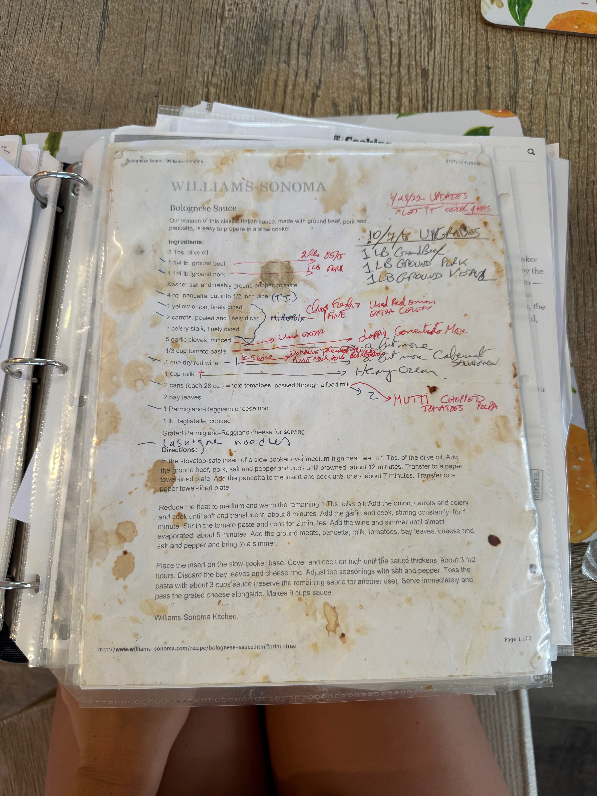

# Bolognese

Makes about 9 cups of sauce

## Ingredients

- 2 tbsp olive oil
- 2 lb ground beef (85/15)
- 1 lb ground pork 
- Kosher salt and freshly ground black pepper to taste
- 4 oz. pancetta, cut into 1/2 inch dice
- 1 yellow onion, finely diced (can use extra)
- 2 carrots, peeled and finely diced
- 1 celery stalk, finely diced (can use extra)
- 5 garlic cloves, minced (can use extra) 
- 1/3 cup tomato paste
- 1 cup dry red wine
- 1 cup  milk or heavy cream 
- 2 cans (each 28 oz) whole tomatoes, passed through a food mill OR mutti chopped tomatoes, or polpa/passata 
- 2 bay leaves
- 1 Parmigiano-Reggiano cheese rind
- 1 lb tagliatelle or parpadelle, cooked (see below for homemade parapadelle or tagliatelle recipe)
- Grated Parmigiano-Reggiano cheese for serving 

## Instructions

1.  In a dutch oven over medium-high heat warm 1 tbsp of olive oil 
2. Add the ground beef, pork, salt and pepper and cook until browned, about 12 minutes and then transfer to a paper towel lined plate
3. Add the pancetta to the pot and cook until crisp, about 7 minutes and then transfer to a paper towel lined plate
4. Reduce the heat to medium and warm the remaining 1 tbsp of oilive oil 
5. Add the onion, carrots, and celery and cook until soft and translucent, about 8 minutes
6. Add the garlic and cook, stirring constantly for 1 minute
7. Stir in the tomato paste and cook for 2 minutes
8. Add the wine and simmer until almost evaporated, about 5 minutes
9. Add the ground meats, pancetta, milk, tomatoes, bay leaves, cheese rind, salt and pepper and bring to a simmer
10. Cover the pot and simmer until the sauce thickens, for at least 4 hours. 
11. Discard the bay leaves and cheese rind, adjust the seasonings with salt and pepper, and mix with parpadelle or tagliatelle

