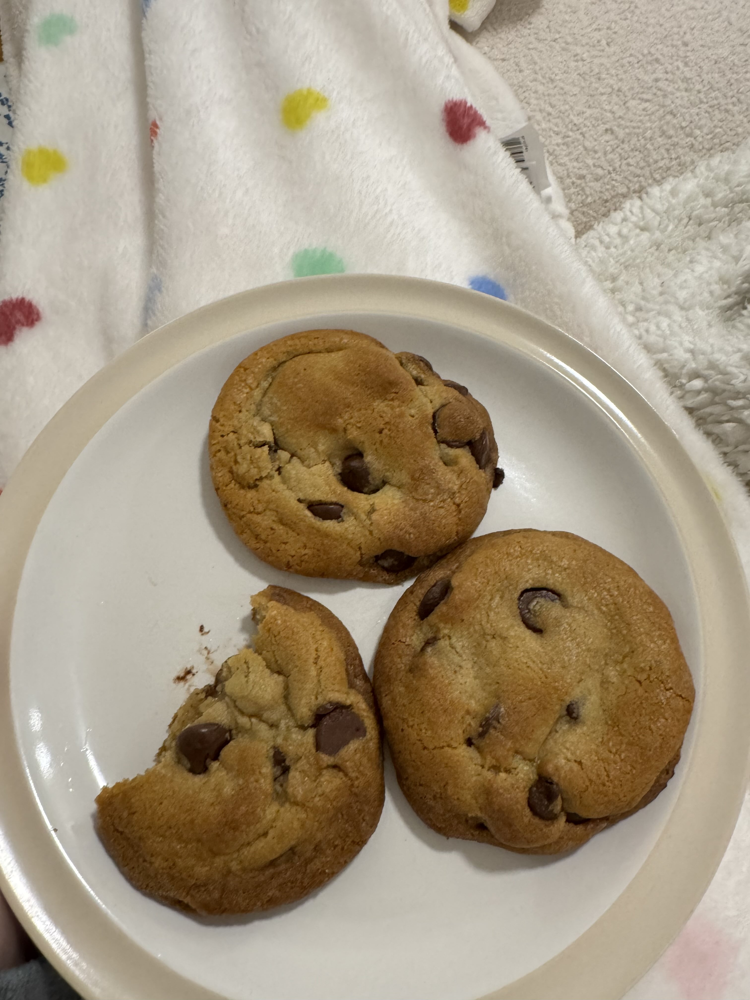
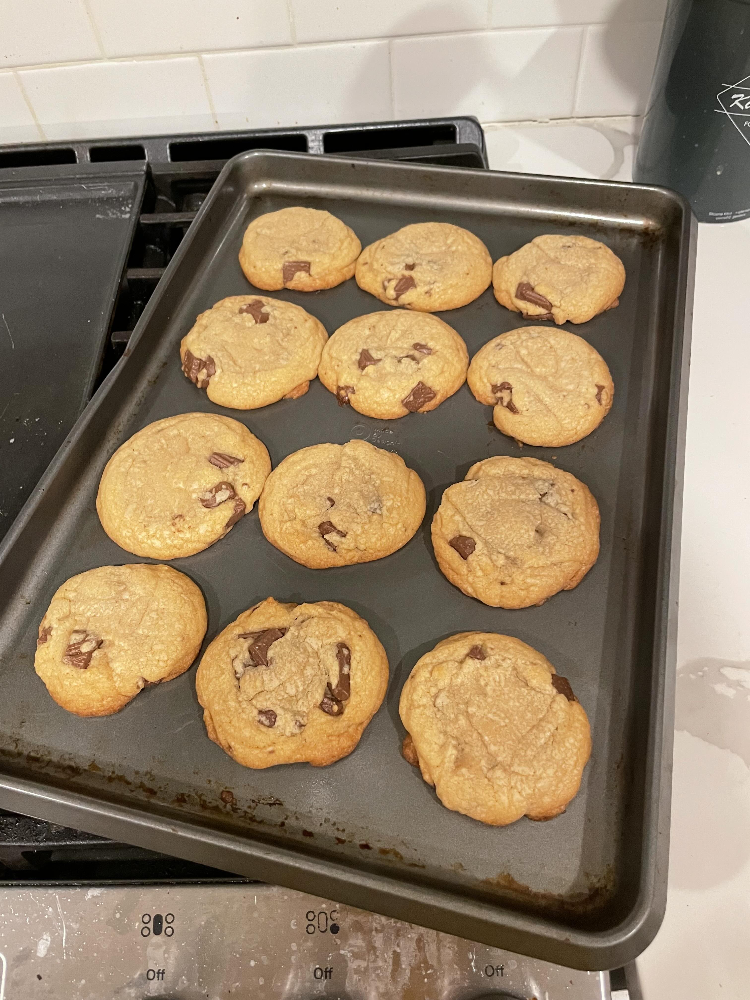
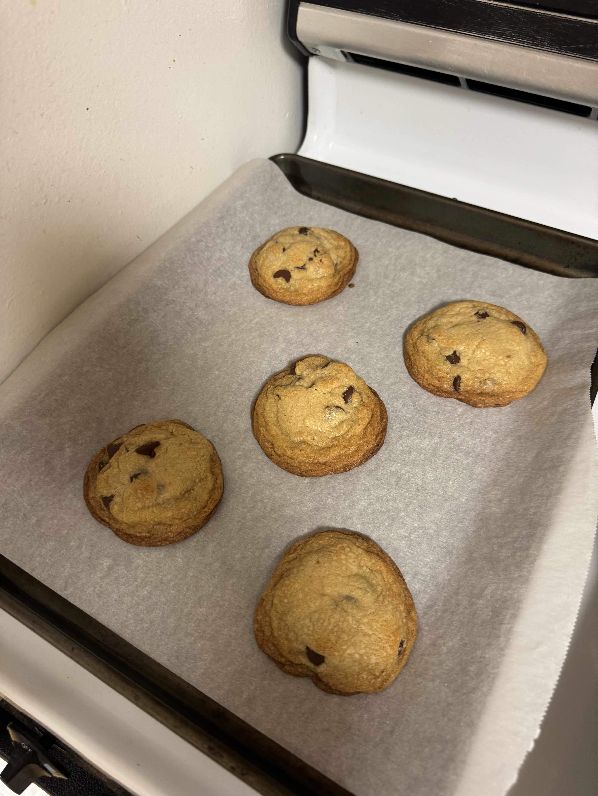
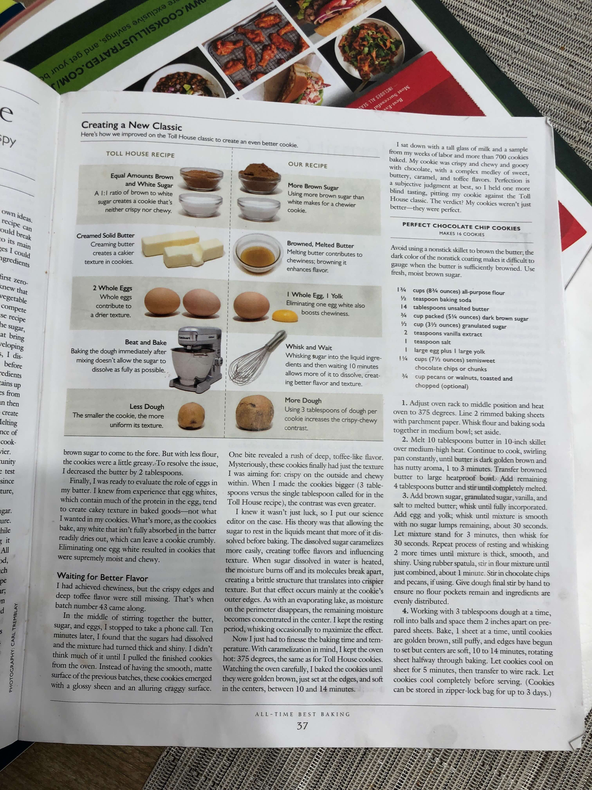

[Table of Contents](/README.md)

# Brown Butter Chocolate Chip Cookies

Makes about 16 cookies.

## Ingredients

- 1 3/4 cup (8 3/4 oz) all-purpose flour
- 1/2 tsp baking soda
- 14 tbsp unsalted butter
- 3/4 cup packed (5 1/4 oz) dark brown sugar
- 1/2 cup (3 1/2 oz) granulated sugar
- 2 tsp vanilla extract
- 1 tsp salt
- 1 large egg + 1 large yolk
- 1 1/4 cup (7 1/2 oz) semisweet chocolate chips or chunks 

## Instructions

1. Adjust oven rack to middle position and preheat oven to 375 degrees
2. Line 2 rimmed baking sheets with parchment paper
3. Whisk flour and baking soda together in medium bowl, set aside
4. Melt 10 tbsp butter in 10 inch skillet over medium-high heat (preferrably avoid using nonstick skillet to brown butter)
5. Continue to cook, swirling pan constantly, untitl butter is dark golden brown and has nutty aroma, 1 to 3 min
6. Transfer browned butter to large heatproof bowl
7. Add remaining 4 tbsp butter and stir until completely melted
8. Add brown sugar, granulated sugar, vanilla, and salt to melted butter and whisk until fully incorporated
9. Add egg and yolk, whisk until mixture is smooth with no sugar lumps remaining, about 30 seconds
10. Let mixture stand for 3 minutes then whisk for 30 seconds
11. Repeat process of resting and whisking 2 more times until mixture is thick, smooth, and shiny 
12. Using rubber spatula stir in flour mixture until just combined, about 1 minute
13. Stir in chocolate chips and give dough a final stir by hand to ensure no flour pockets remain and ingredients are evenly distributed
14. Working with 3 tbsp of dough at a time, roll into balls and space 2 inches apart on prepared sheets
15. Bake 1 sheet at a time until cookies are golden brown, still buffy, and edges have begun to set but centers are soft about 10 to 14 minutes, rotatingg halfway through baking
16. Let cookies cool on sheet for 5 minutes then transfer to wire rack and serve

Reference Recipe:

