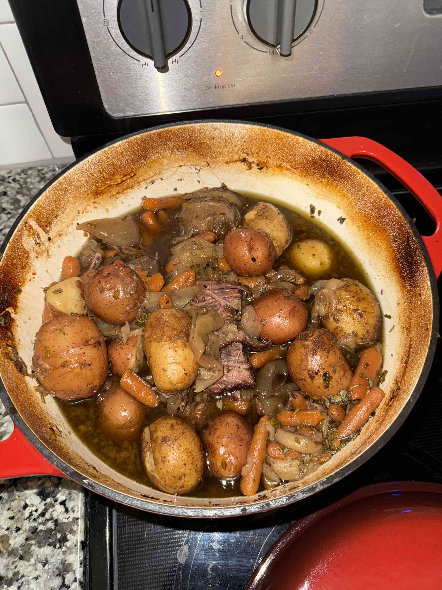
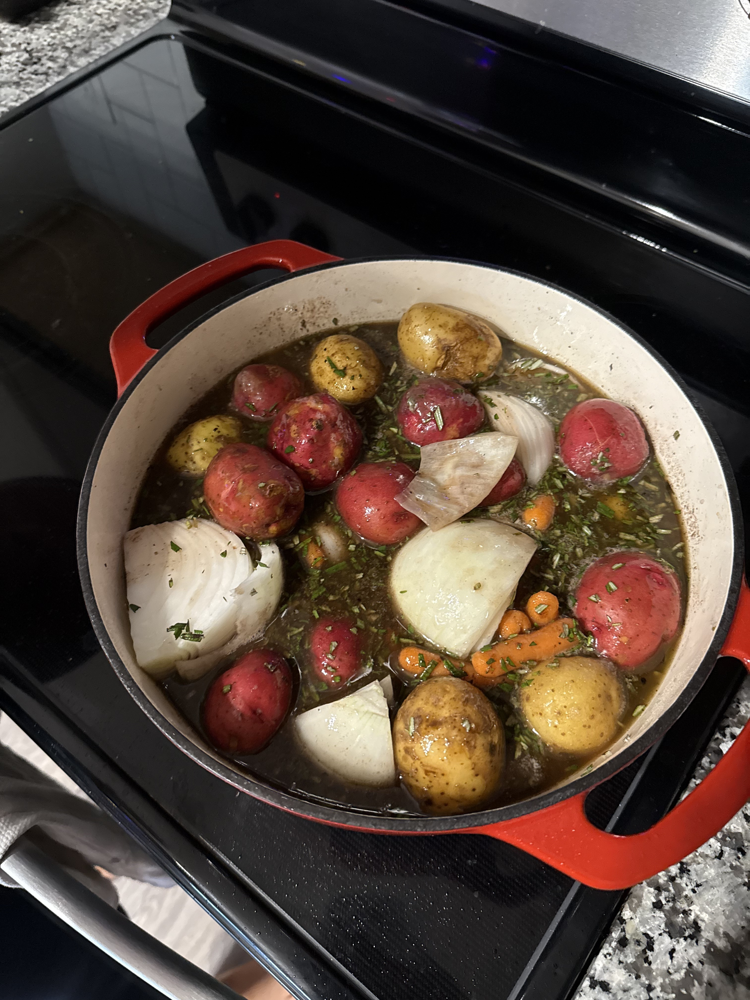
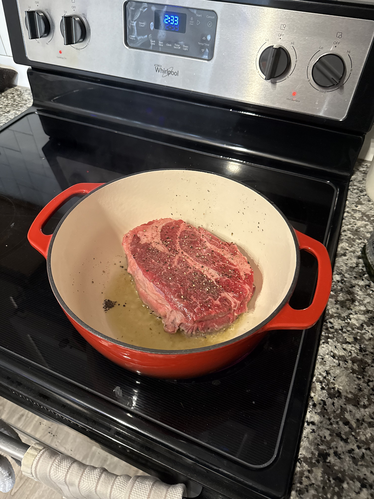
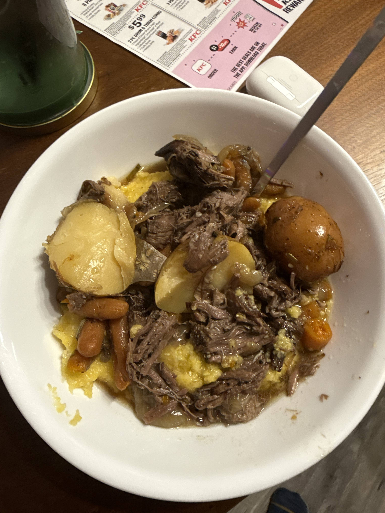

# Chuck Roast

## Ingredients

- 1 white onion
- 1 chuck roast
- Beef stock
- Fresh rosemary
- 1 bag of baby carrots
- Small potates
- 2 cups of red wine
- Salt & pepper

# Instructions

1.  Preheat oven to 300 degrees.
2.  Salt & pepper the hell out of the chuck roast.
3.  On medium-high, sear it on both sides for 5 minutes.
4.  Remove chuck roast from heat.
5.  Reduce wine down for 5 minutes.
6.  Put roast back into the pot. 
7.  Add baby carrots and potatos to the pot.
8.  Quarter onion and add to pot.
9.  Pour in beef stock -- keep the pot half full with beef stock.
10. Chop and add rosemary.
11. Bring up to a boil then, put it in the oven for 4.5 hours.
12. Remove carrots & potatoes and shred the beef with tongs.
13. Serve over polenta. 

