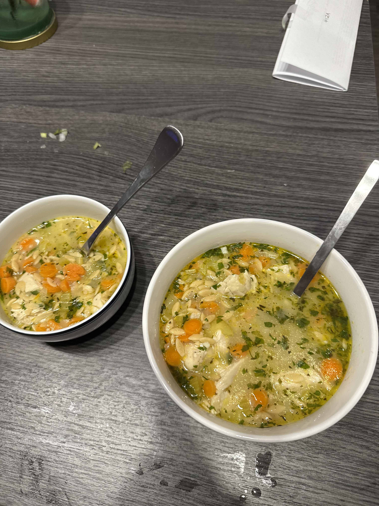

# Lemon Chicken Orzo Soup

## Ingredients

- 2 sticks celery (chopped finely)
- 2 medium carrots (peeled & chopped finely)
- 1 tablespoon butter
- 1 tablespoon olive oil
- 3 cloves garlic (minced)
- 2 tablespoons flour
- 6 cups chicken broth
- 1/4 teaspoon Italian seasoning
- 1.5 pounds uncooked chicken breasts
- 1 cup uncooked orzo
- 1 lemon (or to taste)
- 1 tablespoon chopped fresh parsley (or to taste)
- Salt & pepper (to taste)

## Instructions

1. Sauté the celery, carrots, and onions in a large soup pot with the butter
   and oil over medium-high heat for 5-7 minutes.
2. Stir in the garlic and cook for about 30 seconds, then add the flour and
   cook for another minute or so.
3. Pour in the chicken broth and stir until the flour has dissolved, then add
   the Italian seasoning and chicken. Bring the soup to a boil.
4. Cover the soup (lid slightly open), and reduce the heat and simmer for 15
   minutes.
5. Stir in the orzo and cook for another 10 minutes or until the orzo is cooked
   through. I keep the lid off and stir it fairly often because it tends to
   stick to the bottom of the pot.
6. Take the chicken out of the pot and cut it up, then add it back in. Add the
   lemon juice (you may want to add more than I suggest – I didn't want to make
   the soup too lemony for some people), parsley, and season the soup with salt
   & pepper as needed. Serve immediately.

## References

- https://www.saltandlavender.com/lemon-chicken-orzo-soup/

