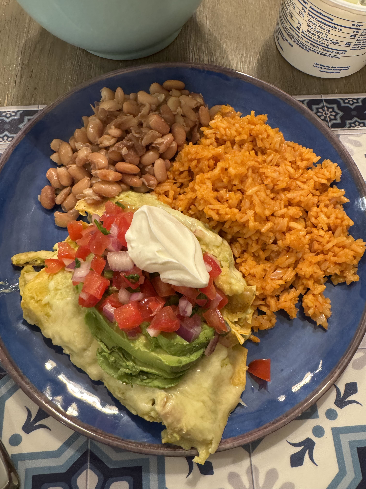
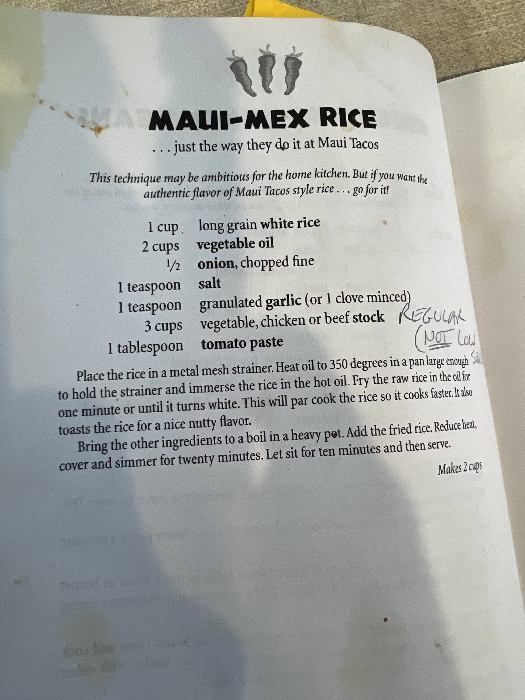

# Mexican Rice 

Makes 2 cups of rice.

## Ingredients

- 1 cup long grain white rice
- 2 cups vegetable oil 
- 1/2 onion, chopped fine 
- 1 tsp salt
- 1 tsp granulated garlic (or 1 clove minced)
- 3 cups vegetable, chicken, or beef stock (regular, not low sodium) 
- 1 tbsp tomato paste

## Instructions

1. Place the rice in a metal mesh strainer 
2. Heat oil to 350 degrees in a pan large enough to hold the strainer and immerse the rice in the hot oil 
3. Fry the raw rice in the oil for one minute or until it turns white - this will par cook the rice so it cooks faster and gives the rice a nutty flavor
4. Bring the other ingredients to a boil in a heavy pot 
5. Add the fried rice, reduce the heat, cover, and simmer for 20 minutes
6. Let the rice sit for 10 minutes and then serve.

Reference Recipe: 

