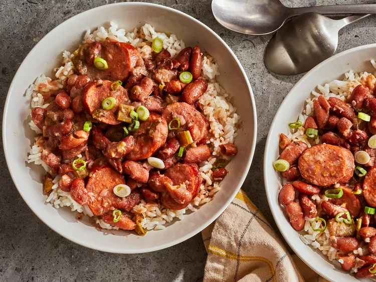

# Red Beans and Rice



## Ingredients

- 1 pound dry kidney beans
- ¼ cup olive oil
- 1 large onion, chopped
- 1 green bell pepper, chopped
- 2 stalks celery, chopped
- 2 tablespoons minced garlic
- 6 cups water
- 2 bay leaves
- 1 tablespoon dried parsley
- 1 teaspoon dried thyme
- 1 teaspoon Cajun seasoning
- ½ teaspoon cayenne pepper
- ¼ teaspoon dried sage
- 1 pound andouille sausage, sliced
- 4 cups water
- 2 cups long grain white rice

## How to cook

1. Rinse beans, and then soak in a large pot of water overnight.
2. Heat oil in a skillet over medium heat. Cook onion, bell pepper, celery, and garlic in olive oil for 3 to 4 minutes.
3. Rinse beans, and transfer to a large pot with 6 cups water. Stir cooked vegetables into beans. Season with bay leaves, parsley, thyme, Cajun seasoning, cayenne pepper, and sage. Bring to a boil, and then reduce heat to medium-low. Simmer for 2 1/2 hours.
4. Stir sausage into beans, and continue to simmer for 30 minutes.
5. Meanwhile, prepare the rice. Bring water and rice to a boil in a saucepan. Reduce heat, cover, and simmer for 20 minutes. Serve beans over steamed white rice.

## Interesting comment

```
This dish was absolutely delicious and packed full of flavor. With any recipe..you have to make it your own. A little of this and a little of that goes a long way. Of course it needs salt..you should add that before anything else is done...Most of these recipes are base recipes..something that you can build from. It's up to you to make it worth your while. With my revisions it was the perfect consistency, perfect flavor, just the right amount of spices..I did omit the celery and garlic clove. I used dried minced garlic, red and green bell peppers, lots of cayenne, Tony's creole seasoning and chicken broth...not that store bought stuff but just regular water with better than boullion chicken base..(can be found in just about any grocery store) instead of water, I also used a little sage and cumin. I replaced the olive oil and used butter. I seasoned my vegetables while they were carmelizing. I loved it and my fiance thought it was the best thing since white bread,,,needless to say I will be making this again.
```

## Reference

https://www.allrecipes.com/recipe/58211/authentic-louisiana-red-beans-and-rice/
